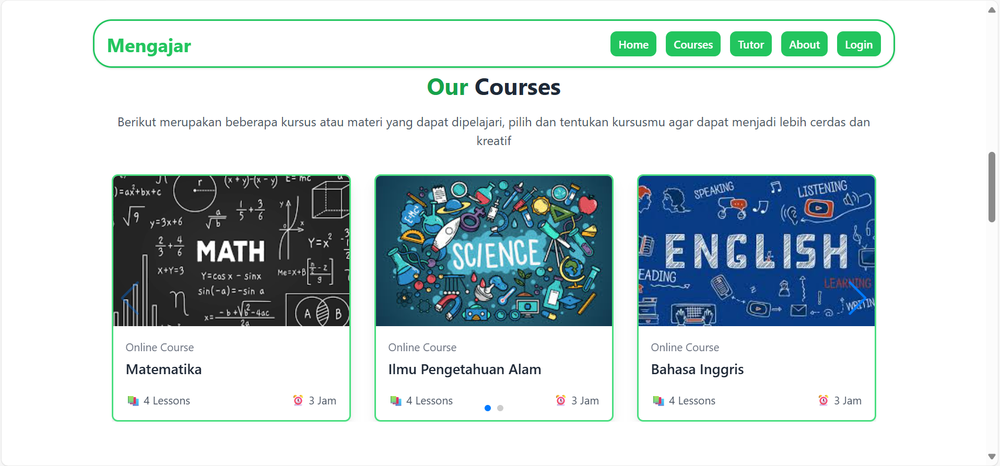
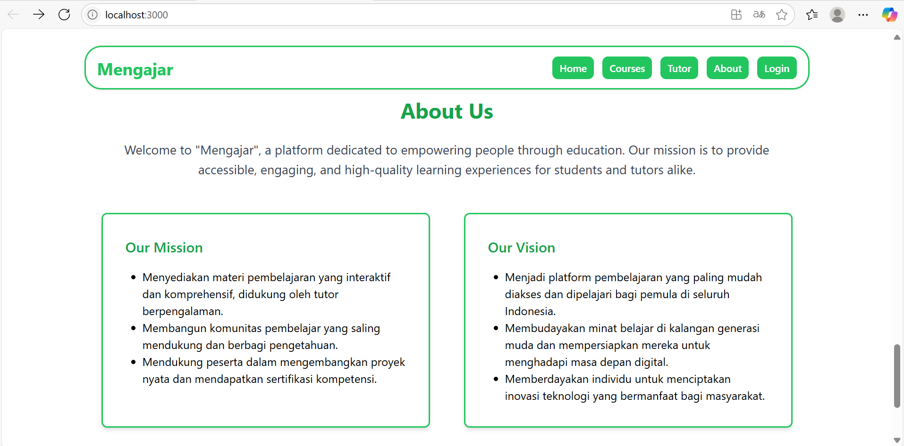
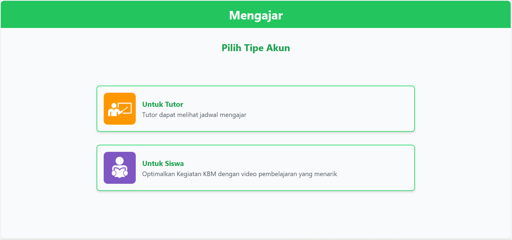
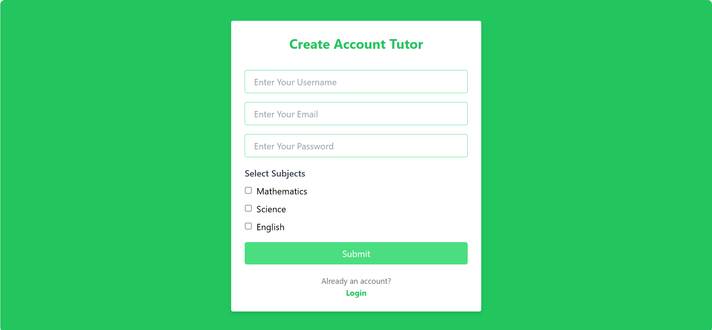
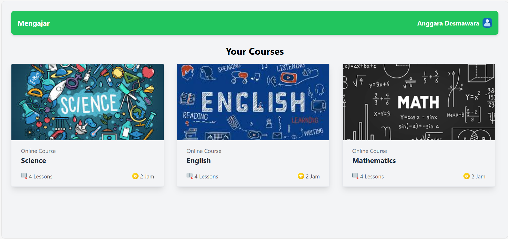
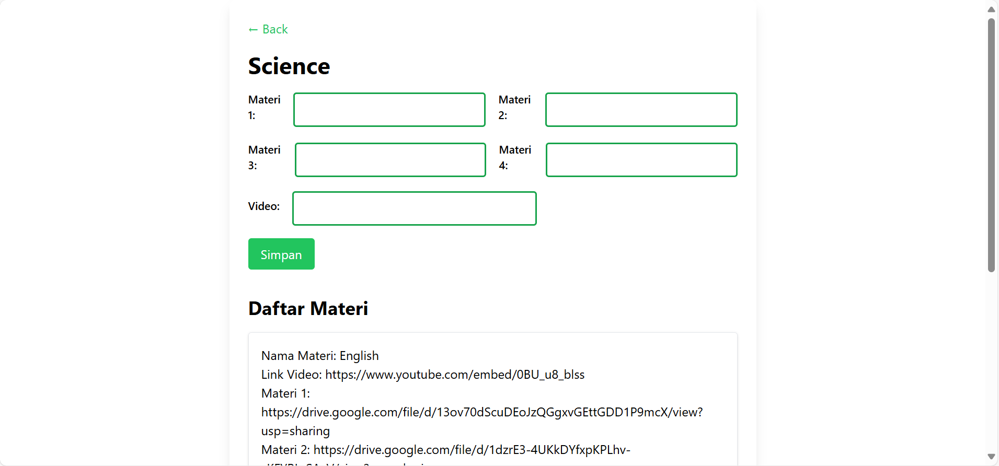
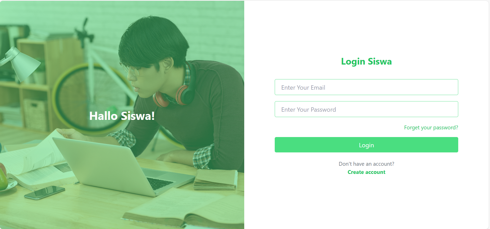
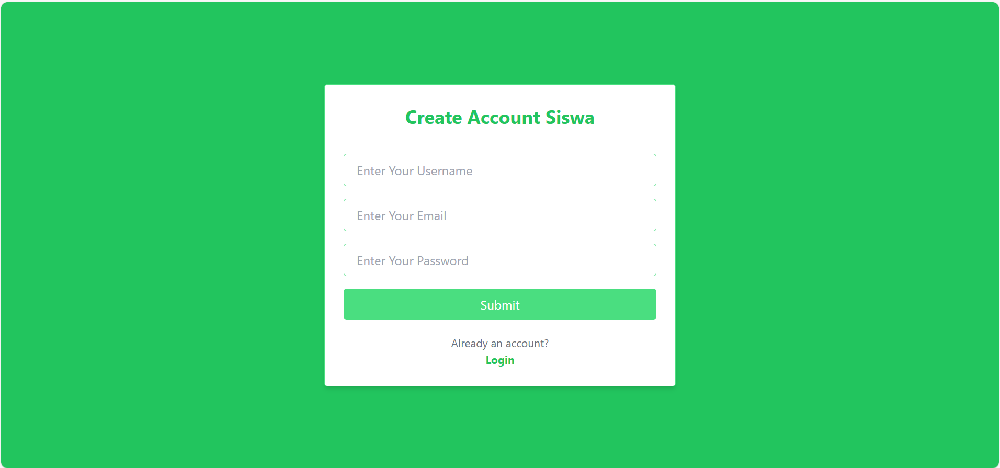
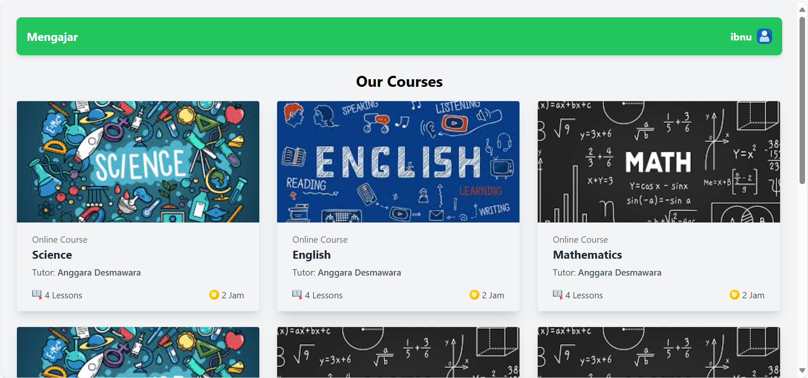
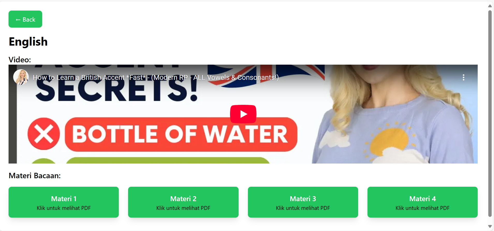

# 📘 Kursus Online Website

Deskripsi singkat tentang aplikasi. Misalnya:

> Aplikasi ini merupakan sistem untuk membantu pembelajaran secara fleksibel dimana dapat membantu siswa yang membutuhkan bimbingan belajar dan para pengajar juga dapat menambahkan materi didalam web ini secara fleksibel.

---

## 🚀 Fitur Utama

- 🔐 Login & SignUp
- 📋 Dashboard Home
- 📋 Dashboard Tutor
- ✅ Input dan Edit Materi
- 📋 Dashboard Siswa
- ✅ Membaca Materi dari Tutor

---

## 📸 Tampilan Setiap Halaman

## 🏠 Dashboard Home








## 🗂️ Pilih Akun



## 👨‍💻 Dashboard Tutor

### 1. Halaman Login


### 2. Halaman SignUp



### 3. Home



### 4. Create Courses



## 🎓 Dashboard Siswa

### 1. Halaman Login



### 2. Halaman SignUp



### 3. Home



### 4. Materi Course



---

## 💻 Cara Instalasi

```bash
git clone https://github.com/username/nama-proyek.git
cd nama-proyek
npm install
npm run start
```
